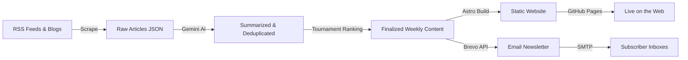
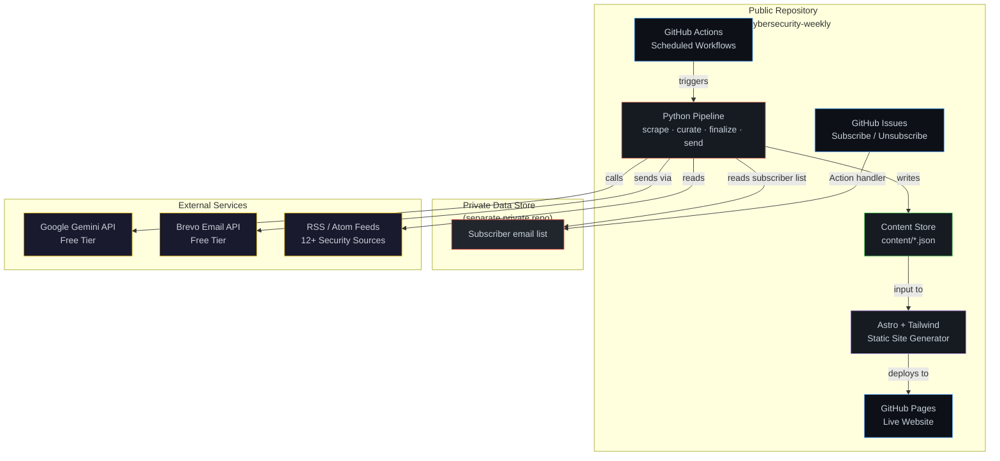
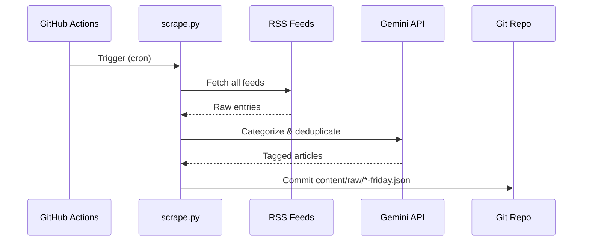
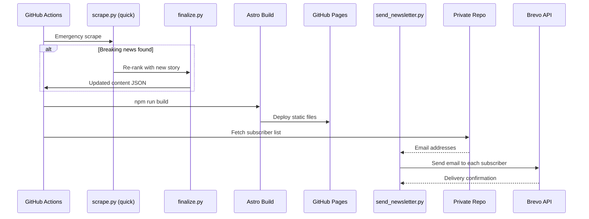
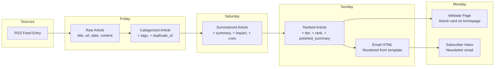
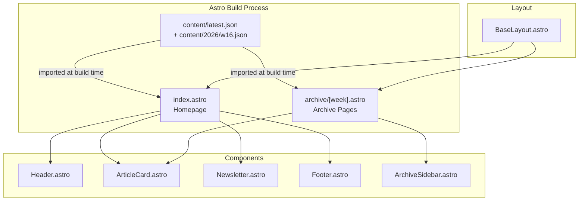
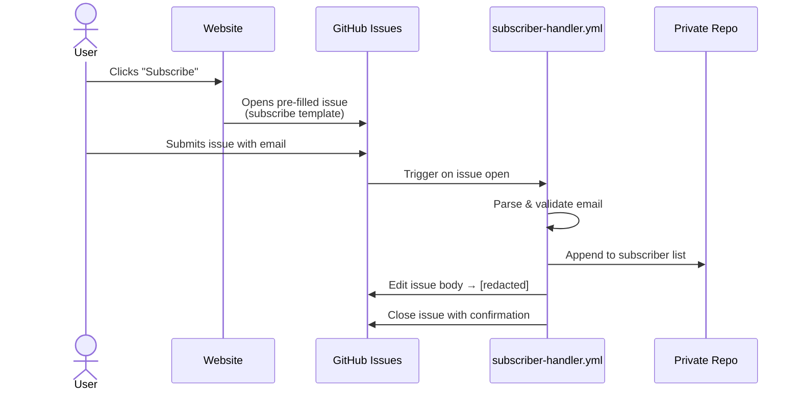
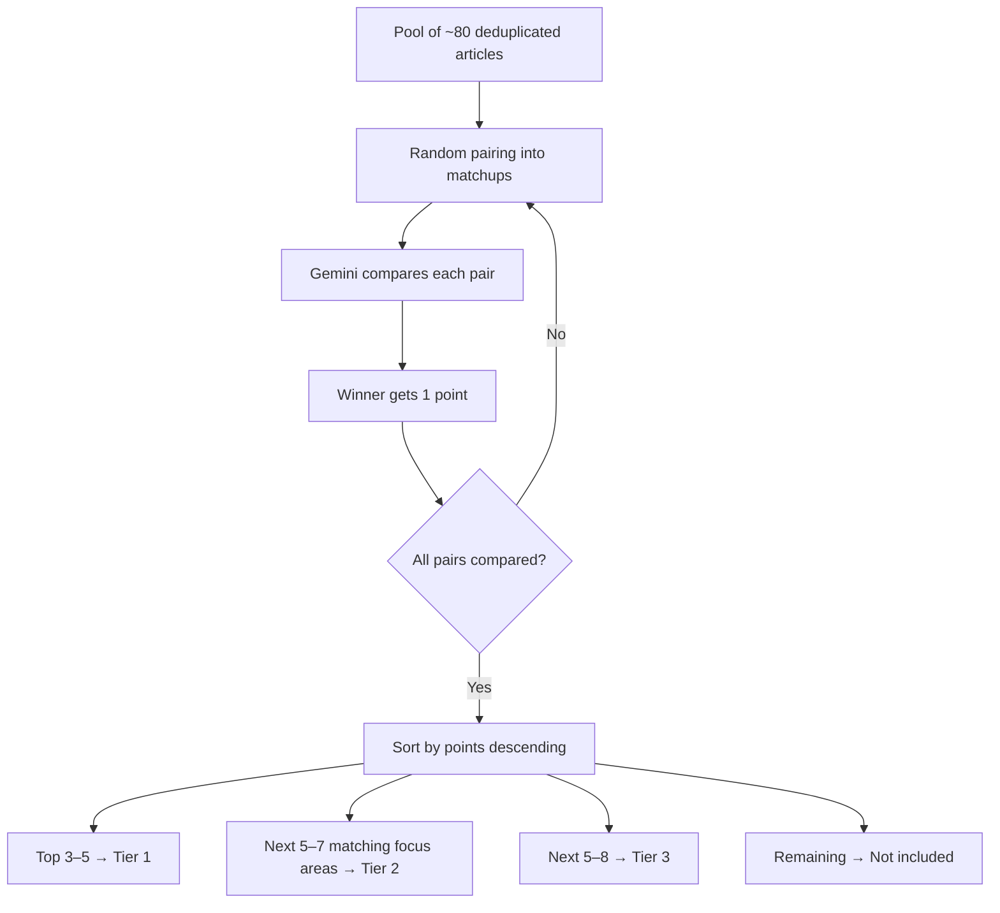
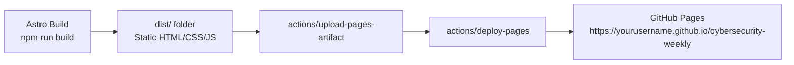

# Cybersecurity Weekly — Functional Specification

> **Version:** 1.0 &nbsp;|&nbsp; **Status:** Draft &nbsp;|&nbsp; **Last Updated:** April 2, 2026
>
> A fully automated, zero-cost cybersecurity newsletter and website that scrapes, curates, ranks, publishes, and emails — every single week — with zero human intervention.

---

## Table of Contents

- [1. System Overview](#1-system-overview)
- [2. High-Level Architecture](#2-high-level-architecture)
- [3. Four-Day Pipeline](#3-four-day-pipeline)
  - [3.1 Friday — Initial Harvest](#31-friday--initial-harvest)
  - [3.2 Saturday — Summarize & Refresh](#32-saturday--summarize--refresh)
  - [3.3 Sunday — Tournament Ranking & Finalization](#33-sunday--tournament-ranking--finalization)
  - [3.4 Monday — Emergency Check, Build & Ship](#34-monday--emergency-check-build--ship)
- [4. Data Flow](#4-data-flow)
- [5. Component Breakdown](#5-component-breakdown)
  - [5.1 Python Scripts (Scraping & Curation)](#51-python-scripts-scraping--curation)
  - [5.2 Astro Site (Frontend)](#52-astro-site-frontend)
  - [5.3 GitHub Actions Workflows](#53-github-actions-workflows)
  - [5.4 Email Template](#54-email-template)
- [6. Data Schemas](#6-data-schemas)
  - [6.1 Raw Article Schema](#61-raw-article-schema)
  - [6.2 Curated Article Schema](#62-curated-article-schema)
  - [6.3 Finalized Weekly Content Schema](#63-finalized-weekly-content-schema)
  - [6.4 Subscriber Schema](#64-subscriber-schema)
- [7. Subscription System](#7-subscription-system)
- [8. AI Integration — Google Gemini](#8-ai-integration--google-gemini)
  - [8.1 Prompt Strategy](#81-prompt-strategy)
  - [8.2 Tournament Ranking Algorithm](#82-tournament-ranking-algorithm)
  - [8.3 Token Budget](#83-token-budget)
- [9. Email Delivery — Brevo](#9-email-delivery--brevo)
- [10. Deployment & Hosting](#10-deployment--hosting)
- [11. Security Model](#11-security-model)
- [12. Error Handling & Resilience](#12-error-handling--resilience)
- [13. News Sources & Feed Registry](#13-news-sources--feed-registry)
- [14. Content Priority Tiers](#14-content-priority-tiers)
- [15. Repository Structure](#15-repository-structure)
- [16. Configuration & Secrets](#16-configuration--secrets)
- [17. Local Development](#17-local-development)
- [18. Future Enhancements](#18-future-enhancements)

---

## 1. System Overview

Cybersecurity Weekly is a **self-operating pipeline** that produces a professional cybersecurity newsletter and companion website on a weekly cadence. The entire system runs on free-tier infrastructure with no server, no database, and no manual steps.



**Core Principles:**

| Principle | Implementation |
|-----------|---------------|
| Zero cost | Every service stays within its free tier |
| Zero intervention | GitHub Actions cron triggers everything automatically |
| Auditable | All content lives as JSON in Git — every change is versioned |
| Privacy-first | Subscriber emails are stored in a separate private repository |
| Resilient | Each pipeline stage is idempotent; failures don't corrupt state |

---

## 2. High-Level Architecture



### Dual-Repo Design

The system is split across **two** GitHub repositories for a clear security boundary:

| Repository | Visibility | Purpose |
|------------|------------|---------|
| `cybersecurity-weekly` | **Public** | All code, workflows, content, website source |
| *(configured via secret)* | **Private** | Subscriber email addresses only |

A GitHub Personal Access Token (PAT) stored as a repo secret allows the public repo's Actions to read/write the private data store. The private repo name is itself stored as a secret (`PRIVATE_REPO`) and never appears in code or documentation.

---

## 3. Four-Day Pipeline

The weekly production cycle spans Friday through Monday, with each stage building on the previous one.

```mermaid
gantt
    title Weekly Pipeline (Pacific Time)
    dateFormat HH:mm
    axisFormat %H:%M

    section Friday
    Initial Harvest    :fri, 16:30, 1h

    section Saturday
    Summarize + Refresh :sat, 12:00, 1h

    section Sunday
    Tournament + Finalize :sun, 18:00, 1h

    section Monday
    Emergency Check     :mon1, 09:00, 15min
    Build & Deploy Site :mon2, after mon1, 15min
    Send Newsletter     :mon3, after mon2, 15min
```



### 3.1 Friday — Initial Harvest

| | |
|---|---|
| **Trigger** | `friday-scrape.yml` — cron `30 23 * * 5` (UTC) |
| **Script** | `scripts/scrape.py` |
| **Input** | `scripts/sources.json` (feed registry) |
| **Output** | `content/raw/{year}-w{week}-friday.json` |

**What happens:**

1. Read the feed registry (`sources.json`) to get all RSS/Atom URLs and fallback HTML selectors.
2. For each source, attempt RSS/Atom parsing via `feedparser`. If the feed is unavailable or stale, fall back to HTML scraping with `httpx` + `BeautifulSoup`.
3. Extract: title, URL, publication date, source name, raw text content.
4. Send the batch to Gemini for a lightweight categorization pass:
   - Tag each article with categories (vulnerability, malware, policy, breach, tool-release, etc.)
   - Flag likely duplicates across sources (same story reported by multiple outlets).
5. Write the result as a timestamped JSON file committed to the repo.



### 3.2 Saturday — Summarize & Refresh

| | |
|---|---|
| **Trigger** | `saturday-curate.yml` — cron `0 19 * * 6` (UTC) |
| **Script** | `scripts/curate.py` |
| **Input** | `content/raw/{year}-w{week}-friday.json` |
| **Output** | `content/raw/{year}-w{week}-saturday.json` |

**What happens:**

1. Load Friday's raw article JSON.
2. Send articles to Gemini in batches for deep summarization:
   - Generate a 2–3 sentence summary per article.
   - Assess impact level (high / medium / low).
   - Identify affected technologies, vendors, and CVEs if applicable.
3. Run a fresh scrape of all sources to catch articles published after Friday's harvest.
4. Merge new articles into the pool, using Gemini to deduplicate against existing entries.
5. Commit the merged, summarized dataset.

### 3.3 Sunday — Tournament Ranking & Finalization

| | |
|---|---|
| **Trigger** | `sunday-finalize.yml` — cron `0 1 * * 1` (UTC) |
| **Script** | `scripts/finalize.py` |
| **Input** | `content/raw/{year}-w{week}-saturday.json` |
| **Output** | `content/{year}/w{week}.json`, `content/latest.json` |

**What happens:**

1. One final scrape for any weekend-breaking stories — merge and deduplicate.
2. Run the **tournament ranking algorithm** (see [Section 8.2](#82-tournament-ranking-algorithm)):
   - All articles compete head-to-head through Gemini comparisons.
   - Top stories are selected and assigned to Tier 1 / 2 / 3.
3. Generate polished, publication-ready summaries for each selected article.
4. Generate a newsletter subject line via Gemini.
5. Render the HTML email body using `templates/email.html` as the Jinja2 template.
6. Write the finalized weekly JSON file and update `content/latest.json` to point to it.
7. Commit everything.

```mermaid
flowchart TD
    A[Load Saturday JSON] --> B[Final Weekend Scrape]
    B --> C[Merge & Deduplicate]
    C --> D{Tournament Ranking}
    D --> E[Tier 1: Major Breaking]
    D --> F[Tier 2: Focus Areas]
    D --> G[Tier 3: Noteworthy]
    E --> H[Generate Polished Summaries]
    F --> H
    G --> H
    H --> I[Generate Subject Line]
    I --> J[Render Email HTML]
    J --> K[Write w{week}.json + latest.json]
    K --> L[Git Commit]
```

### 3.4 Monday — Emergency Check, Build & Ship

| | |
|---|---|
| **Trigger** | `monday-send.yml` — cron `0 16 * * 1` (UTC) |
| **Scripts** | `scripts/scrape.py` (quick mode), `scripts/send_newsletter.py` |
| **Input** | `content/{year}/w{week}.json`, subscriber list (from private data store) |
| **Output** | Live website on GitHub Pages + emails delivered |

**What happens:**

1. **Emergency scrape**: Quick check of high-priority sources only. If a story scores above the emergency threshold (determined by Gemini), inject it as the top Tier 1 story and regenerate the email.
2. **Build**: Run the Astro static site generator. Content JSON is loaded at build time to populate the homepage and archive pages.
3. **Deploy**: Push the built site to GitHub Pages via the built-in `actions/deploy-pages` action.
4. **Send**: Fetch the subscriber list from the private data store. Send the pre-rendered HTML email to every subscriber via the Brevo transactional email API.



---

## 4. Data Flow

This diagram traces a single article from its origin as an RSS entry to a subscriber's inbox.



### Data Persistence Model

All data is stored as JSON files committed directly to the Git repository. There is no database.

| File Pattern | Written By | Read By | Lifecycle |
|-------------|-----------|---------|-----------|
| `content/raw/{year}-w{week}-friday.json` | `scrape.py` | `curate.py` | Intermediate — can be pruned after finalization |
| `content/raw/{year}-w{week}-saturday.json` | `curate.py` | `finalize.py` | Intermediate — can be pruned after finalization |
| `content/{year}/w{week}.json` | `finalize.py` | Astro build, `send_newsletter.py` | Permanent — archived weekly content |
| `content/latest.json` | `finalize.py` | Astro build (homepage) | Overwritten weekly — always points to the current edition |
| Subscriber list *(private data store)* | `subscriber_handler.py` | `send_newsletter.py` | Persistent — append/remove only |

---

## 5. Component Breakdown

### 5.1 Python Scripts (Scraping & Curation)

All Python scripts live in `scripts/` and share a common set of dependencies defined in `scripts/requirements.txt`.

<details>
<summary><strong>scripts/scrape.py</strong> — Source Scraping</summary>

**Responsibility:** Fetch articles from all configured news sources.

**Modes:**
- `full` (default) — Scrape all sources. Used Friday–Sunday.
- `quick` — Scrape only high-priority sources. Used Monday for emergency check.

**Key behaviors:**
- Reads `scripts/sources.json` for the feed registry.
- Tries RSS/Atom via `feedparser` first; falls back to HTTP + BeautifulSoup for HTML parsing.
- Extracts: title, URL, published date, source name, full text or first 2000 characters.
- Filters out articles older than 7 days.
- Handles rate limiting with exponential backoff.
- Returns structured JSON written to `content/raw/`.

**Dependencies:** `feedparser`, `httpx`, `beautifulsoup4`, `lxml`

</details>

<details>
<summary><strong>scripts/curate.py</strong> — AI Summarization & Deduplication</summary>

**Responsibility:** Enrich raw articles with AI-generated summaries, impact assessments, and deduplication.

**Key behaviors:**
- Loads raw article JSON from Friday's scrape.
- Sends articles to Gemini in batches (10 articles per request) to stay within rate limits.
- For each article, Gemini returns: 2–3 sentence summary, impact level (high/medium/low), affected technologies, relevant CVE IDs.
- Cross-references articles to find duplicates (same story from different sources). The highest-quality source version is kept as primary; others are linked as `also_reported_by`.
- Merges in freshly scraped articles from a Saturday scrape pass.

**Dependencies:** `google-generativeai`

</details>

<details>
<summary><strong>scripts/finalize.py</strong> — Tournament Ranking & Email Rendering</summary>

**Responsibility:** Select and rank the week's best stories, assign tiers, render the newsletter email.

**Key behaviors:**
- Runs the tournament ranking algorithm (see [Section 8.2](#82-tournament-ranking-algorithm)).
- Generates polished, publication-grade summaries.
- Assigns each selected article to Tier 1, 2, or 3.
- Generates a compelling email subject line.
- Renders the HTML email using Jinja2 with `templates/email.html`.
- Writes the finalized `content/{year}/w{week}.json` and updates `content/latest.json`.

**Dependencies:** `google-generativeai`, `jinja2`

</details>

<details>
<summary><strong>scripts/send_newsletter.py</strong> — Brevo Email Dispatch</summary>

**Responsibility:** Send the pre-rendered HTML newsletter to all subscribers.

**Key behaviors:**
- Reads the subscriber list from the private data store (checked out by the workflow).
- Reads the finalized weekly JSON for the email subject and HTML body.
- Sends individual transactional emails via the Brevo REST API.
- Respects Brevo free-tier rate limits (300 emails/day).
- Logs delivery status for each recipient.
- Handles bounces gracefully (marks undeliverable addresses for review).

**Dependencies:** `sib-api-v3-sdk` (Brevo Python SDK)

</details>

<details>
<summary><strong>scripts/subscriber_handler.py</strong> — Issue-Based Subscription Manager</summary>

**Responsibility:** Process subscribe/unsubscribe requests from GitHub Issues.

**Key behaviors:**
- Triggered by `subscriber-handler.yml` when an issue is opened.
- Parses the issue body to extract the email address.
- Validates the email format.
- For subscribes: appends to the subscriber list in the private data store.
- For unsubscribes: removes the email from the list.
- Edits the issue body to replace the email with `[redacted]` for privacy.
- Closes the issue with a confirmation comment.

**Dependencies:** `PyGithub`

</details>

<details>
<summary><strong>scripts/sources.json</strong> — Feed Registry</summary>

A JSON configuration file defining all news sources. Each entry contains:

```json
{
  "id": "krebs",
  "name": "Krebs on Security",
  "url": "https://krebsonsecurity.com",
  "feed_url": "https://krebsonsecurity.com/feed/",
  "feed_type": "rss",
  "fallback_selector": "article.post",
  "priority": "high",
  "categories": ["investigative", "breach", "cybercrime"]
}
```

| Field | Type | Description |
|-------|------|-------------|
| `id` | string | Unique source identifier |
| `name` | string | Human-readable source name |
| `url` | string | Website homepage |
| `feed_url` | string | RSS/Atom feed URL |
| `feed_type` | string | `rss`, `atom`, or `html` (scrape-only) |
| `fallback_selector` | string | CSS selector for HTML scraping fallback |
| `priority` | string | `high` or `normal` — high-priority sources are included in Monday's emergency scrape |
| `categories` | string[] | Default tags for articles from this source |

</details>

### 5.2 Astro Site (Frontend)

The website is built with [Astro](https://astro.build) and [Tailwind CSS](https://tailwindcss.com), generating a fully static site deployed to GitHub Pages.



| Component | Purpose |
|-----------|---------|
| `BaseLayout.astro` | Shared HTML shell — `<head>`, meta tags, global styles, nav, footer slot |
| `Header.astro` | Site branding, navigation links (Home, Archive, Subscribe) |
| `Footer.astro` | Copyright, social links, "Powered by" attribution |
| `ArticleCard.astro` | Renders a single article: tier badge, title, source, summary, link |
| `Newsletter.astro` | Subscribe call-to-action section with link to GitHub Issue template |
| `ArchiveSidebar.astro` | Navigation listing all past weekly editions |

**Pages:**

| Route | Source | Description |
|-------|--------|-------------|
| `/` | `index.astro` | Current week's curated articles, grouped by tier |
| `/archive/w16` | `archive/[week].astro` | Historical weekly edition. Dynamically generated for each `w{nn}.json` file. |

### 5.3 GitHub Actions Workflows

All workflows live in `.github/workflows/` and are triggered by cron schedules (UTC) or GitHub events.

| Workflow | Trigger | Steps | Artifacts |
|----------|---------|-------|-----------|
| `friday-scrape.yml` | Cron: `30 23 * * 5` | Checkout → Setup Python → `scrape.py --mode full` → Commit & push | `content/raw/*-friday.json` |
| `saturday-curate.yml` | Cron: `0 19 * * 6` | Checkout → Setup Python → `scrape.py --mode full` → `curate.py` → Commit & push | `content/raw/*-saturday.json` |
| `sunday-finalize.yml` | Cron: `0 1 * * 1` | Checkout → Setup Python → `scrape.py --mode full` → `finalize.py` → Commit & push | `content/{year}/w{week}.json` |
| `monday-send.yml` | Cron: `0 16 * * 1` | Checkout → Setup Python + Node → `scrape.py --mode quick` → (optional re-rank) → `npm run build` → Deploy Pages → `send_newsletter.py` | Live site + emails |
| `subscriber-handler.yml` | `on: issues` (opened) | Checkout → Setup Python → `subscriber_handler.py` → Push to private data store | Updated subscriber list |

```mermaid
flowchart TD
    subgraph "Cron Triggers (UTC)"
        F[Fri 23:30] --> FW[friday-scrape.yml]
        S[Sat 19:00] --> SW[saturday-curate.yml]
        SU[Mon 01:00] --> SUW[sunday-finalize.yml]
        M[Mon 16:00] --> MW[monday-send.yml]
    end

    subgraph "Event Triggers"
        ISS[Issue Opened] --> SH[subscriber-handler.yml]
    end

    FW -->|writes| RAW1[raw/*-friday.json]
    SW -->|reads| RAW1
    SW -->|writes| RAW2[raw/*-saturday.json]
    SUW -->|reads| RAW2
    SUW -->|writes| FINAL[w{week}.json]
    MW -->|reads| FINAL
    MW -->|builds| SITE[GitHub Pages]
    MW -->|sends| MAIL[Brevo Emails]
    SH -->|updates| PRIV[Private Data Store]
```

### 5.4 Email Template

`templates/email.html` is a Jinja2 HTML template with **inline CSS** for maximum email client compatibility.

**Template Variables:**

| Variable | Type | Description |
|----------|------|-------------|
| `{{ week_number }}` | int | ISO week number |
| `{{ year }}` | int | Year |
| `{{ subject }}` | string | AI-generated subject line |
| `{{ tier1_articles }}` | list | Tier 1 articles (major breaking) |
| `{{ tier2_articles }}` | list | Tier 2 articles (focus areas) |
| `{{ tier3_articles }}` | list | Tier 3 articles (noteworthy) |
| `{{ unsubscribe_url }}` | string | Link to unsubscribe issue template |
| `{{ website_url }}` | string | Link to the website edition |

---

## 6. Data Schemas

### 6.1 Raw Article Schema

Written by `scrape.py` after the initial harvest.

```json
{
  "id": "sha256-of-url",
  "title": "Critical RCE Vulnerability in OpenSSH — CVE-2026-XXXX",
  "url": "https://example.com/article",
  "source_id": "bleepingcomputer",
  "source_name": "BleepingComputer",
  "published_at": "2026-03-28T14:30:00Z",
  "scraped_at": "2026-03-28T23:30:00Z",
  "content_text": "Full or truncated article text (max 2000 chars)...",
  "categories": ["vulnerability", "remote-code-execution"],
  "duplicate_of": null
}
```

### 6.2 Curated Article Schema

Written by `curate.py` after AI summarization.

```json
{
  "id": "sha256-of-url",
  "title": "Critical RCE Vulnerability in OpenSSH — CVE-2026-XXXX",
  "url": "https://example.com/article",
  "source_id": "bleepingcomputer",
  "source_name": "BleepingComputer",
  "published_at": "2026-03-28T14:30:00Z",
  "summary": "A critical remote code execution vulnerability in OpenSSH allows unauthenticated attackers to gain root access. The flaw affects versions 9.0 through 9.7 and has been actively exploited in the wild.",
  "impact": "high",
  "affected_technologies": ["OpenSSH", "Linux", "BSD"],
  "cves": ["CVE-2026-XXXX"],
  "categories": ["vulnerability", "remote-code-execution"],
  "also_reported_by": ["krebs", "hackernews"]
}
```

### 6.3 Finalized Weekly Content Schema

Written by `finalize.py`. This is the canonical file consumed by Astro and the email renderer.

```json
{
  "week": 16,
  "year": 2026,
  "generated_at": "2026-04-20T01:00:00Z",
  "subject": "OpenSSH Under Siege, AI-Powered Phishing Surges, and CISA's New Directive",
  "email_html": "<html>...rendered newsletter...</html>",
  "articles": [
    {
      "id": "sha256-of-url",
      "rank": 1,
      "tier": 1,
      "title": "Critical RCE Vulnerability in OpenSSH — CVE-2026-XXXX",
      "url": "https://example.com/article",
      "source_name": "BleepingComputer",
      "published_at": "2026-03-28T14:30:00Z",
      "summary": "A critical remote code execution vulnerability...",
      "polished_summary": "This week's most critical story: OpenSSH versions 9.0–9.7 contain a remote code execution flaw that grants unauthenticated root access. CISA has added it to the Known Exploited Vulnerabilities catalog, and patching is underway across major cloud providers.",
      "impact": "high",
      "cves": ["CVE-2026-XXXX"],
      "categories": ["vulnerability"],
      "also_reported_by": ["krebs", "hackernews"]
    }
  ],
  "stats": {
    "total_scraped": 142,
    "total_after_dedup": 87,
    "total_selected": 15,
    "tier1_count": 3,
    "tier2_count": 5,
    "tier3_count": 7
  }
}
```

### 6.4 Subscriber Schema

Stored in the **private data store** (separate private GitHub repository, name configured via secret).

```json
{
  "subscribers": [
    {
      "email": "reader@example.com",
      "subscribed_at": "2026-03-15T10:00:00Z",
      "source": "github-issue",
      "issue_number": 42
    }
  ],
  "unsubscribed": [
    {
      "email": "former@example.com",
      "subscribed_at": "2026-03-01T08:00:00Z",
      "unsubscribed_at": "2026-03-20T14:00:00Z",
      "issue_number": 57
    }
  ]
}
```

---

## 7. Subscription System

The subscription system uses **GitHub Issues as an input channel** to avoid needing a backend server.



**Issue Templates:**

<details>
<summary><strong>.github/ISSUE_TEMPLATE/subscribe.yml</strong></summary>

```yaml
name: Subscribe
description: Subscribe to Cybersecurity Weekly
title: "[Subscribe]"
labels: ["subscription"]
body:
  - type: input
    id: email
    attributes:
      label: Email Address
      description: Enter your email to receive the weekly newsletter.
      placeholder: you@example.com
    validations:
      required: true
```

</details>

<details>
<summary><strong>.github/ISSUE_TEMPLATE/unsubscribe.yml</strong></summary>

```yaml
name: Unsubscribe
description: Unsubscribe from Cybersecurity Weekly
title: "[Unsubscribe]"
labels: ["subscription"]
body:
  - type: input
    id: email
    attributes:
      label: Email Address
      description: Enter the email you want to unsubscribe.
      placeholder: you@example.com
    validations:
      required: true
```

</details>

**Privacy safeguards:**
- The email is redacted from the issue body immediately after processing.
- The issue is closed automatically — it exists only as an audit trail.
- Actual email storage is in the private data store, invisible to the public.

---

## 8. AI Integration — Google Gemini

### 8.1 Prompt Strategy

All AI interactions use the **Gemini 2.0 Flash** model (free tier) through the `google-generativeai` Python SDK. Prompts are designed to be structured and deterministic.

| Stage | Prompt Purpose | Input | Expected Output |
|-------|---------------|-------|-----------------|
| Friday | Categorization & dedup detection | Raw article batch (title + snippet) | JSON array of `{id, categories, duplicate_of}` |
| Saturday | Summarization & impact assessment | Full article text | JSON array of `{id, summary, impact, cves, technologies}` |
| Sunday | Tournament ranking | Pairs of article summaries | JSON `{winner_id, reasoning}` |
| Sunday | Polished summary generation | Article summary + context | Publication-ready paragraph |
| Sunday | Subject line generation | Top 3 article titles | Single subject line string |
| Monday | Emergency assessment | Freshly scraped headlines | JSON `{is_emergency: bool, article_id}` |

All prompts enforce **JSON output** using Gemini's response schema feature, ensuring reliable parsing without fragile regex extraction.

### 8.2 Tournament Ranking Algorithm

The ranking system uses a **round-robin tournament** where articles are compared pairwise by Gemini.



**Comparison prompt structure:**

```
You are a cybersecurity news editor. Compare these two articles and
decide which is MORE important for a weekly security newsletter.
Consider: severity, breadth of impact, novelty, and actionability.

Article A: {title_a} — {summary_a}
Article B: {title_b} — {summary_b}

Respond with JSON: {"winner": "A" or "B", "reasoning": "..."}
```

**Optimizations:**
- Only articles not marked as duplicates enter the tournament.
- Articles scoring zero wins in the first round are eliminated early.
- The total number of Gemini calls scales as `O(n)` matchups (not full `O(n^2)`) by using a Swiss-system pairing after the first round.

### 8.3 Token Budget

The Gemini free tier provides **1,500 requests/day** and **1M tokens/day**.

| Pipeline Stage | Estimated Requests | Estimated Tokens | Headroom |
|---------------|-------------------|------------------|----------|
| Friday — Categorization | ~15 | ~200K | Well within limits |
| Saturday — Summarization | ~20 | ~400K | Well within limits |
| Sunday — Tournament + Rendering | ~50 | ~300K | Well within limits |
| Monday — Emergency Check | ~5 | ~100K | Well within limits |
| **Weekly Total** | **~90** | **~1M of 4M** | **75% headroom** |

Each stage runs on a separate day, so there is no risk of hitting the daily cap.

---

## 9. Email Delivery — Brevo

| Parameter | Value |
|-----------|-------|
| **Service** | [Brevo](https://www.brevo.com) (formerly Sendinblue) |
| **Tier** | Free — 300 emails/day |
| **API** | Transactional Email REST API v3 |
| **SDK** | `sib-api-v3-sdk` (Python) |

**Sending strategy:**

1. Fetch the subscriber list from the private data store.
2. For each subscriber, send an individual transactional email (not bulk/campaign) so each recipient sees only their own address.
3. Rate limit to ~5 emails/second to stay well within API limits.
4. Log the HTTP status for each send.
5. If a send fails with a permanent error (hard bounce), flag the email for removal.

**Email headers:**

| Header | Value |
|--------|-------|
| `From` | `Cybersecurity Weekly <newsletter@cybersecurityweekly.dev>` |
| `Reply-To` | `hello@cybersecurityweekly.dev` |
| `List-Unsubscribe` | Link to unsubscribe issue template |

---

## 10. Deployment & Hosting



| Setting | Value |
|---------|-------|
| **Hosting** | GitHub Pages |
| **Source** | GitHub Actions (artifact-based deployment) |
| **Custom Domain** | Optional — configurable via CNAME |
| **HTTPS** | Enforced by GitHub Pages |
| **CDN** | GitHub's built-in Fastly CDN |
| **Build Tool** | Astro (`npm run build` produces static `dist/`) |

The `monday-send.yml` workflow handles the build and deploy as part of the same pipeline that sends the newsletter, ensuring the website and email are always in sync.

---

## 11. Security Model

| Concern | Mitigation |
|---------|-----------|
| **Subscriber email privacy** | Emails stored in a separate private data store; redacted from public issues immediately |
| **API key exposure** | All API keys stored as GitHub Actions encrypted secrets — never in code |
| **PAT scope** | The `PRIVATE_REPO_TOKEN` has the minimum scope needed to read/write the private data store |
| **Injection via issues** | `subscriber_handler.py` validates email format with a strict regex before processing; all other issue body content is discarded |
| **Supply chain** | Python dependencies are pinned to exact versions in `requirements.txt` |
| **Content integrity** | All content is Git-versioned — tampering creates a visible diff |
| **Rate limiting** | Scraping uses polite intervals; Gemini and Brevo calls respect published rate limits |

---

## 12. Error Handling & Resilience

Each pipeline stage is designed to be **idempotent** and **failure-tolerant**.

| Failure Scenario | Recovery Strategy |
|-----------------|-------------------|
| RSS feed is down | Skip that source; log a warning. The article pool still has 11+ other sources. |
| Gemini API rate limit hit | Exponential backoff with 3 retries. If all retries fail, use the previous stage's output without AI enrichment for that batch. |
| Gemini returns malformed JSON | Parse with fallback: retry the prompt once, then skip the article and log it. |
| Brevo delivery failure (soft bounce) | Retry on next week's send. |
| Brevo delivery failure (hard bounce) | Flag the subscriber for review; do not retry. |
| GitHub Actions timeout | Each workflow has a 30-minute timeout. Partial results are committed so the next stage can pick up where it left off. |
| Private data store unreachable | `send_newsletter.py` logs an error and exits without sending. The site still deploys. Newsletter can be sent manually or on retry. |
| No articles scraped | If Friday's scrape returns zero articles, a warning issue is created. Saturday's scrape acts as a full backup harvest. |
| Emergency scrape on Monday finds nothing | Normal flow continues — the pre-built Sunday content ships as-is. |

**Logging:**
- Each script writes structured logs to stdout, captured by GitHub Actions.
- Errors create GitHub Actions annotations visible in the workflow run summary.

---

## 13. News Sources & Feed Registry

| Source | Feed URL | Type | Priority |
|--------|----------|------|----------|
| Security Now (GRC) | `https://feeds.twit.tv/sn.xml` | RSS | High |
| Krebs on Security | `https://krebsonsecurity.com/feed/` | RSS | High |
| The Hacker News | `https://feeds.feedburner.com/TheHackersNews` | RSS | High |
| BleepingComputer | `https://www.bleepingcomputer.com/feed/` | RSS | High |
| Dark Reading | `https://www.darkreading.com/rss.xml` | RSS | High |
| CISA Advisories | `https://www.cisa.gov/cybersecurity-advisories/all.xml` | Atom | High |
| Ars Technica Security | `https://feeds.arstechnica.com/arstechnica/security` | RSS | Normal |
| CrowdStrike Blog | `https://www.crowdstrike.com/blog/feed/` | RSS | Normal |
| Mandiant (Google) | `https://cloud.google.com/blog/topics/threat-intelligence/rss/` | RSS | Normal |
| Palo Alto Unit 42 | `https://unit42.paloaltonetworks.com/feed/` | RSS | Normal |
| Sophos News | `https://news.sophos.com/en-us/feed/` | RSS | Normal |
| Recorded Future | `https://www.recordedfuture.com/feed` | RSS | Normal |

**Extensibility:** New sources are added by appending an entry to `scripts/sources.json`. No code changes required.

---

## 14. Content Priority Tiers

| Tier | Label | Selection Criteria | Typical Count |
|------|-------|-------------------|---------------|
| **1** | Major Breaking | Highest tournament score; widespread impact; actively exploited vulns; nation-state campaigns | 3–5 articles |
| **2** | Focus Areas | Matches project niche topics: 5G security, indoor small cells, NMS/webapp management, telecom infrastructure | 5–7 articles |
| **3** | Noteworthy | Strong tournament performance; notable but narrower impact — new malware families, policy changes, tool releases | 5–8 articles |
| — | Not Included | Did not make the cut; stored in raw JSON for archival reference | Remainder |

**Tier 2 focus area keywords** (configurable in `scripts/sources.json` or a separate `focus_areas.json`):

```json
[
  "5G", "5G security", "small cell", "indoor wireless",
  "network management system", "NMS", "webapp management",
  "telecom", "RAN", "Open RAN", "CBRS",
  "network infrastructure", "carrier security"
]
```

---

## 15. Repository Structure

```
cybersecurity-weekly/                   # Public repository
│
├── .github/
│   ├── ISSUE_TEMPLATE/
│   │   ├── subscribe.yml               # Subscription form template
│   │   └── unsubscribe.yml             # Unsubscribe form template
│   └── workflows/
│       ├── friday-scrape.yml            # Cron: Fri 4:30 PM PT (23:30 UTC)
│       ├── saturday-curate.yml          # Cron: Sat 12:00 PM PT (19:00 UTC)
│       ├── sunday-finalize.yml          # Cron: Sun 6:00 PM PT (01:00 Mon UTC)
│       ├── monday-send.yml              # Cron: Mon 9:00 AM PT (16:00 UTC)
│       └── subscriber-handler.yml       # Event: on issue opened
│
├── src/
│   ├── components/
│   │   ├── ArticleCard.astro            # Single article display card
│   │   ├── Header.astro                 # Site header / navigation
│   │   ├── Footer.astro                 # Site footer
│   │   ├── Newsletter.astro             # Subscribe CTA section
│   │   └── ArchiveSidebar.astro         # Weekly edition navigation
│   ├── layouts/
│   │   └── BaseLayout.astro             # Shared HTML shell
│   └── pages/
│       ├── index.astro                  # Homepage — current week
│       └── archive/
│           └── [week].astro             # Dynamic archive pages
│
├── content/
│   ├── raw/                             # Intermediate scrape data
│   │   ├── 2026-w16-friday.json
│   │   └── 2026-w16-saturday.json
│   ├── 2026/
│   │   └── w16.json                     # Finalized weekly content
│   └── latest.json                      # Pointer to current week
│
├── scripts/
│   ├── requirements.txt                 # Pinned Python dependencies
│   ├── sources.json                     # Feed registry
│   ├── scrape.py                        # RSS/HTML scraper
│   ├── curate.py                        # AI summarization & dedup
│   ├── finalize.py                      # Tournament ranking & email render
│   ├── send_newsletter.py               # Brevo email dispatch
│   └── subscriber_handler.py            # Issue-based subscription manager
│
├── templates/
│   └── email.html                       # Jinja2 HTML email template
│
├── public/
│   └── favicon.svg                      # Site favicon
│
├── docs/
│   └── FUNCTIONAL_SPEC.md              # This document
│
├── astro.config.mjs                     # Astro configuration
├── tailwind.config.mjs                  # Tailwind CSS configuration
├── package.json                         # Node.js dependencies
└── README.md                            # Project overview
```

The private data store is a separate private GitHub repository whose name and structure
are configured via GitHub Secrets. It is not documented here for security reasons.

---

## 16. Configuration & Secrets

### GitHub Actions Secrets (Public Repo)

| Secret | Description | Required By |
|--------|-------------|-------------|
| `GEMINI_API_KEY` | Google Gemini API key from [AI Studio](https://aistudio.google.com/apikey) | `curate.py`, `finalize.py`, `scrape.py` (emergency) |
| `BREVO_API_KEY` | Brevo transactional email API key from [Brevo Dashboard](https://app.brevo.com/) | `send_newsletter.py` |
| `PRIVATE_REPO_TOKEN` | GitHub PAT with `repo` scope for the private data store | `send_newsletter.py`, `subscriber_handler.py` |
| `PRIVATE_REPO` | Full name of the private data store (e.g. `owner/repo-name`) | `monday-send.yml` |
| `PRIVATE_REPO_NAME` | Repo name only (e.g. `repo-name`) | `subscriber-handler.yml` |

### Environment Variables (Set in Workflows)

| Variable | Purpose | Example |
|----------|---------|---------|
| `SCRAPE_MODE` | Controls scrape depth | `full` or `quick` |
| `CONTENT_DIR` | Path to content directory | `content/` |
| `YEAR` | Current year | `2026` |
| `WEEK` | Current ISO week number | `16` |

---

## 17. Local Development

```bash
# Clone the repository
git clone https://github.com/yourusername/cybersecurity-weekly.git
cd cybersecurity-weekly

# Install Node.js dependencies (Astro + Tailwind)
npm install

# Install Python dependencies
pip install -r scripts/requirements.txt

# Set up environment variables for local testing
export GEMINI_API_KEY="your-key-here"
export BREVO_API_KEY="your-key-here"

# Run Astro dev server (hot-reload)
npm run dev

# Run individual pipeline stages manually
python scripts/scrape.py --mode full
python scripts/curate.py
python scripts/finalize.py
python scripts/send_newsletter.py --dry-run
```

To test with sample data without making real API calls, use the `--mock` flag:

```bash
python scripts/scrape.py --mock          # Uses cached sample feeds
python scripts/curate.py --mock          # Uses dummy Gemini responses
python scripts/finalize.py --mock        # Skips tournament, uses random ranking
```

---

## 18. Future Enhancements

| Enhancement | Description | Priority |
|-------------|-------------|----------|
| RSS output feed | Publish an RSS/Atom feed of curated content so readers can follow via feed readers | Medium |
| Analytics dashboard | Track open rates, click rates, subscriber growth via Brevo webhooks | Low |
| Multi-language support | AI-translated editions in Spanish, German, Japanese | Low |
| Slack/Discord integration | Post the weekly digest to a channel via webhooks | Medium |
| Podcast companion | Auto-generate a TTS audio summary using a free text-to-speech API | Low |
| Reader voting | Allow subscribers to upvote/downvote stories to improve future ranking | Medium |
| Dark mode | Add a dark/light toggle to the Astro site | Medium |
| Search | Full-text search across all archived editions using Pagefind (static search) | High |

---

<p align="center">
<sub>This specification is a living document. It will be updated as the project evolves through each build phase.</sub>
</p>
